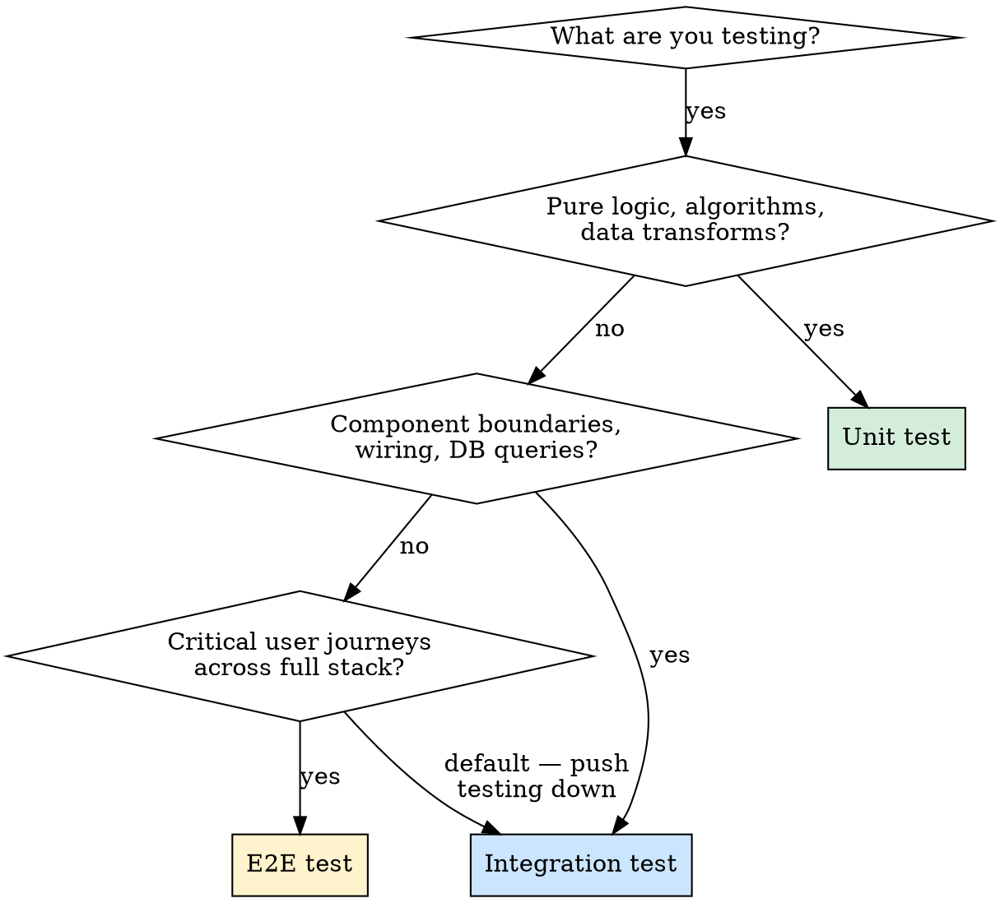
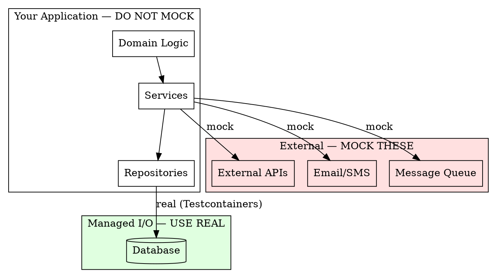

# Writing Effective Tests

## Overview

**Process + Craft.** Good testing requires both: the discipline to write the test first (TDD process) and the knowledge to write the *right* test (craft). This skill integrates both.

**The Iron Law:** No production code without a failing test first. Write code before the test? Delete it. Start over.

**The Core Quality:** Resistance to refactoring. If internal restructuring breaks the test but behavior hasn't changed, the test is wrong, not the code.

## Language-Specific Examples

This skill's principles are language-agnostic. Load the examples file for your project's language:

- **Python** (pytest, FastAPI, SQLAlchemy): Read `examples/python.md`
- **Java** (JUnit 5, Spring Boot, Mockito): Read `examples/java.md`
- **Node.js/TypeScript** (Jest/Vitest, Express/NestJS): Read `examples/node.md`

Detect the language from the project's build files (`requirements.txt`/`pyproject.toml` → Python, `pom.xml`/`build.gradle` → Java, `package.json` → Node.js).

## Project-Specific Patterns

Before writing tests, check for project conventions in `docs/development/TEST_PATTERNS.md`, `.claude/skills/` in the project root, and `CLAUDE.md`. Read and follow any patterns found.

**Conflict resolution:** Project patterns win for their project. But **flag the conflict**: "Note: project pattern X contradicts general best practice Y. Following project pattern. Should we align these?" This prevents silent drift.

## The Cycle: RED → GREEN → REFACTOR

Every feature, bug fix, and behavior change follows this cycle. At each step, craft decisions determine quality.

```dot
digraph tdd_craft {
    rankdir=LR;
    red [label="RED\n1. Choose test type\n2. Set mock boundary\n3. Write failing test", shape=box, style=filled, fillcolor="#ffcccc"];
    verify_red [label="Watch it fail\n(correct reason)", shape=diamond];
    green [label="GREEN\nMinimal code\nto pass", shape=box, style=filled, fillcolor="#ccffcc"];
    verify_green [label="All tests\npass?", shape=diamond];
    refactor [label="REFACTOR\nImprove testability\n(stay green)", shape=box, style=filled, fillcolor="#ccccff"];

    red -> verify_red;
    verify_red -> green [label="fails correctly"];
    verify_red -> red [label="wrong failure\nor passes"];
    green -> verify_green;
    verify_green -> refactor [label="yes"];
    verify_green -> green [label="no"];
    refactor -> verify_green;
}
```



---

## RED: Write the Failing Test

Before writing ANY production code, make three craft decisions:

### Decision 1: What Type of Test?



**Test ratio by architecture:**

| Architecture | Shape | Ratio |
|---|---|---|
| Monolith with rich domain logic | Pyramid | 70% unit, 20% integration, 10% E2E |
| API service / microservice | Honeycomb | 20% unit, 70% integration, 10% E2E |
| Frontend SPA | Trophy | 20% unit, 60% integration, 20% E2E |

**When in doubt:** Write an integration test. They give the highest confidence-per-test for most modern applications.

### Decision 2: What to Mock?

This is the single most misunderstood concept. Get this right:



**Rules:**
- **Mock unmanaged dependencies** — external APIs, email, message queues (things other systems observe)
- **Do NOT mock managed dependencies** — your own classes, repositories, domain objects
- **Do NOT mock the database session/connection** — asserting that `db.save` was called is testing implementation. Use a real test database.
- **Do NOT mock things you don't own** — don't mock HTTP libraries or DB drivers. Use fakes or real instances.

**Test doubles quick reference:**

| Double | Purpose | Assert On It? | Use For |
|--------|---------|---------------|---------|
| **Stub** | Returns canned data | Never | Provide input to SUT |
| **Fake** | Working shortcut implementation | Never | Replace slow dependencies |
| **Mock** | Records calls for verification | Yes | Outgoing side effects at boundary |

**Critical rule:** Never assert on stubs. Verifying a stub was called = testing implementation.

**When a service mixes logic with I/O:** Don't mock the DB to "unit test" it. Either:
1. Extract pure logic → unit test logic, integration test orchestration
2. Integration test the whole method with real DB + mock only external APIs

### Decision 3: Write the Test

**Structure — Arrange-Act-Assert:** Set up the scenario (Arrange), perform exactly one action (Act), verify the outcome (Assert). One Act per test — multiple acts = multiple behaviors = split into separate tests.

**Name by behavior, not method:**

- BAD: `test_check_access_returns_false` — coupled to method name
- GOOD: `test_expired_subscription_cannot_access_premium_content` — describes scenario and outcome
- GOOD: `test_discount_applied_when_order_exceeds_100` — describes the business rule

**Prefer testing styles in this order:**
1. **Output-based** — feed input, check return value (most refactor-resistant)
2. **State-based** — perform action, check resulting state
3. **Communication-based** — verify mock interactions (ONLY for outgoing side effects)

### Watch It Fail

**MANDATORY. Never skip.**

Run the test. Confirm:
- Test **fails** (not errors)
- Failure message matches what you expect
- Fails because **feature is missing** (not a typo or import error)

Test passes immediately? You're testing existing behavior or wrote a tautology. Fix the test.

---

## GREEN: Write Minimal Code

Write the **simplest code** that makes the test pass. Nothing more.

- Don't add features the test doesn't require
- Don't refactor yet
- Don't "improve" surrounding code
- Don't add error handling the test doesn't exercise

Run all tests. Everything must be green.

**Test fails?** Fix the code, not the test. If you can't pass without changing the test, the test is wrong — go back to RED.

---

## REFACTOR: Improve While Staying Green

Now improve code quality. Tests protect you.

### Improve Testability

**Functional Core, Imperative Shell** — push logic into pure functions, I/O at edges. A method that interleaves DB reads, business logic, and LLM calls in sequence is hard to test. Extract the pure logic pieces (`build_prompt`, `parse_response`) as standalone functions that can be unit tested. The orchestrator method that wires them together becomes an integration test target.

**Humble Object Pattern** — when code is entangled with a framework entry point (a task decorator, a controller, a CLI command), extract all logic into a testable class. Keep the framework entry point trivially thin — too simple to break.

**Dependency Injection** — pass dependencies in, don't construct them inside functions. A function that creates its own `Database("connection-string")` is untestable; one that accepts a `db` parameter is.

### Keep Tests Green

After every refactor step, run tests. If anything breaks, undo and try smaller steps.

### Then: Next RED

Write the next failing test for the next behavior. Repeat the cycle.

---

## What to Test — Decision Guide

### MUST Test
- Business rules and domain logic
- Data transformations (especially money, permissions, user data)
- Error handling paths (auth, authorization, input validation)
- Anything that has broken before (regression tests)
- Integration boundaries (DB queries, API contracts)

### SKIP Testing
- Trivial code with no conditionals or logic
- Framework behavior (routing, ORM mapping, serialization)
- Third-party library internals
- Private methods — test through public interface
- Code about to be deleted or rewritten

### The Beyonce Rule (Google)
*"If you liked it, you should have put a test on it."* If a behavior matters and it breaks, there should have been a test.

---

## Integration Test Patterns

**Database:** Use the same DB engine as production (not SQLite). Run it in a container (Testcontainers or equivalent). Use transaction rollback per test for isolation. Use factory functions with generated IDs — never shared global fixtures or hardcoded IDs.

**API:** Test the full request/response cycle through the real router. Always test error paths: 401, 403, 404, 422, 500. Error handling is where production bugs live.

**E2E:** 5-15 tests covering critical user journeys. Prefer API-level over UI-level. If you can verify it at integration level, push the test down.

---

## Bug Fix Workflow

1. **Write regression test** that reproduces the exact bug (RED — it must fail)
2. **Fix the bug** (GREEN — test passes)
3. **Refactor** if needed (stay green)

Name the test after the bug, cite the ticket, capture the exact broken input. **Never fix bugs without a failing test first.**

**Documenting known gaps:** When you find missing validation, write a test asserting the current (wrong) behavior with a comment explaining the correct behavior and what to change when it's fixed. This prevents "fix later" from becoming "forgotten entirely."

---

## Testing Tricky Dependencies

**Time-dependent code:** Use a dedicated time-freezing library — do NOT patch the standard datetime class with a generic mock. Always test the boundary: `expires_at == now`.

**Async code:** Use async-aware test utilities. Do not use synchronous mocks for async coroutines. Watch fixture scope: event loop scope often conflicts with session-scoped DB fixtures.

**Background task runners:** "Always eager" mode doesn't test real serialization or retries. Use the humble object pattern: extract logic out of the task, test logic directly, test framework-specific behavior separately.

**Parametrized tests:** Use your framework's parametrize feature for boundary values. Cover: zero items, one item, many items, all-fail, some-fail cases for any batch operation.

---

## Rationalizations — STOP and Start Over

### Process Rationalizations (skipping TDD)

| Excuse | Reality |
|--------|---------|
| "Too simple to test" | Simple code breaks. Test takes 30 seconds. |
| "I'll test after" | Tests passing immediately prove nothing. |
| "Already manually tested" | Ad-hoc is not systematic. No record, can't re-run. |
| "Deleting X hours is wasteful" | Sunk cost fallacy. Keeping unverified code is tech debt. |
| "Need to explore first" | Fine. Throw away exploration, start fresh with TDD. |

### Craft Rationalizations (writing wrong tests)

| Excuse | Reality |
|--------|---------|
| "I'll mock the DB so it's faster" | Transaction rollback is nearly as fast and tests real behavior |
| "I need to verify db.add was called" | That's testing implementation. Check DB state instead. |
| "SQLite is fine for tests" | SQLite silently differs from Postgres on types, constraints, JSON. Same engine. |
| "I'll mock the repository" | The repository IS part of the service's behavior. Integration test. |
| "I need 100% coverage" | Coverage finds gaps. 70-85% for domain logic is the sweet spot. |

### Red Flags — All Mean Delete and Restart

- Code before test
- Test passes immediately
- "I already manually tested it"
- "Tests after achieve the same purpose"
- "This is different because..."
- Asserting on stubs (verifying a mock was called for incoming data)
- Mocking internal collaborators

---

## Advanced Techniques

**Property-Based Testing:** Define invariants that hold for all inputs (e.g., `decode(encode(x)) == x`). Generate arbitrary inputs and assert the invariant. Best for: serialization roundtrips, parsers, data transformations. Tools: `hypothesis` (Python), `jqwik` (Java), `fast-check` (TypeScript).

**Mutation Testing:** Automatically mutates production code (`>` → `>=`, `True` → `False`) and reruns tests. Passing tests with mutations = tests that don't verify behavior. Tools: `mutmut` (Python), `pitest` (Java). Use periodically on critical domain logic.

**Delete Tests That Don't Earn Their Keep:** Every test has maintenance cost. Delete tests that haven't caught a bug in years, break on every refactor, test trivial behavior, or are more complex than the code they test.

---

## Real-World Anti-Patterns (from Code Reviews)

| # | Anti-Pattern | Wrong | Right |
|---|---|---|---|
| 1 | **Fake tenant isolation** — creates data as tenant A, queries as tenant A. Never switches tenant. Passes even if RLS is broken. | `save as A → query as A → assert found` | `save as A → switch to B → query as B → assert empty` |
| 2 | **Security disabled in tests** — a `TestSecurityConfig` permits all requests. Auth annotations become invisible. | `test config: allow all requests` | Use real security config; test with role-annotated user: assert 403 for employee on admin endpoint, 401 for unauthenticated |
| 3 | **Asserting on internal DAO calls** — `verify(dao.insert())` breaks when impl switches to `batchInsert()`, even though behavior is unchanged. | `assert dao.insert() was called` | `assert response.id is not null` + `assert db.findById(id) exists` |
| 4 | **Competing data setup with hardcoded IDs** — SQL seed file + `setUp()` both insert `id=1` with `ON CONFLICT DO NOTHING`. Silent collisions, invisible coupling between files. | Two mechanisms, `id=1` hardcoded | One mechanism only; use generated UUIDs everywhere |
| 5 | **Global lenient mock strictness** — suppresses "unused stub" warnings. Dead setup accumulates silently. | `strictness = LENIENT` globally | Default strict mode; apply lenient per-stub only when genuinely needed |
| 6 | **@Transactional isolation with non-JPA data access** — framework holds connection A; the data access library grabs connection B for the same rows → deadlock. | `@Transactional` on test class | No `@Transactional`; explicit `setUp` / `tearDown`; delete children before parents (FK order); run single-threaded |
| 7 | **Hardcoded dates** — `startDate = 2025-01-01` passes when written, fails after that date is in the past. | `startDate = specific past date` | `startDate = today + 1 month` |
| 8 | **Asserting immediately on async results** — background job hasn't finished; assertion is a race condition. | `POST /jobs/123/process` → assert status immediately | Poll every 500ms until status == expected, timeout after ~10s |

---

## Quick Reference Card

```
PHASE       | CRAFT DECISION                        | KEY QUESTION
----------- | ------------------------------------- | ---------------------------
RED         | Choose test type (unit/integ/E2E)     | What layer is the behavior?
RED         | Set mock boundary                     | Mock external only, real DB
RED         | Write failing test (AAA, good name)   | Does it test behavior, not impl?
VERIFY RED  | Watch it fail                         | Correct failure reason?
GREEN       | Minimal code to pass                  | Am I adding untested features?
REFACTOR    | Improve testability                   | Can I extract pure functions?
REFACTOR    | Stay green                            | Did I break anything?

TEST TYPE   | WHAT TO TEST                    | MOCK WHAT           | SPEED
----------- | ------------------------------- | ------------------- | -----
Unit        | Pure logic, business rules      | Nothing (or ext I/O)| <10ms
Integration | DB queries, API contracts       | External APIs only  | <5s
E2E         | Critical user journeys (5-15)   | Nothing             | <30s
Property    | Invariants, roundtrips, parsers | Same as unit        | varies
```
